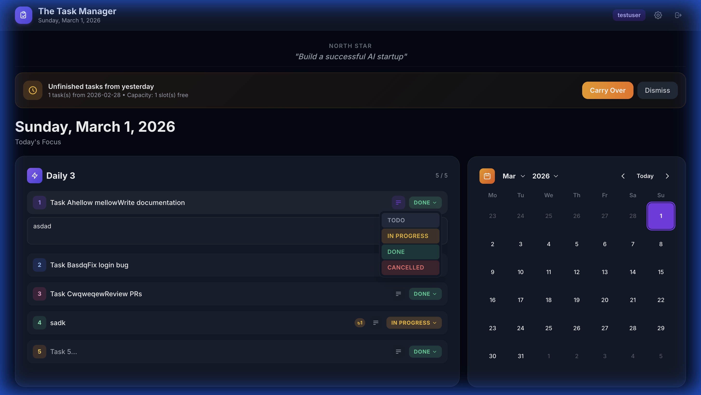
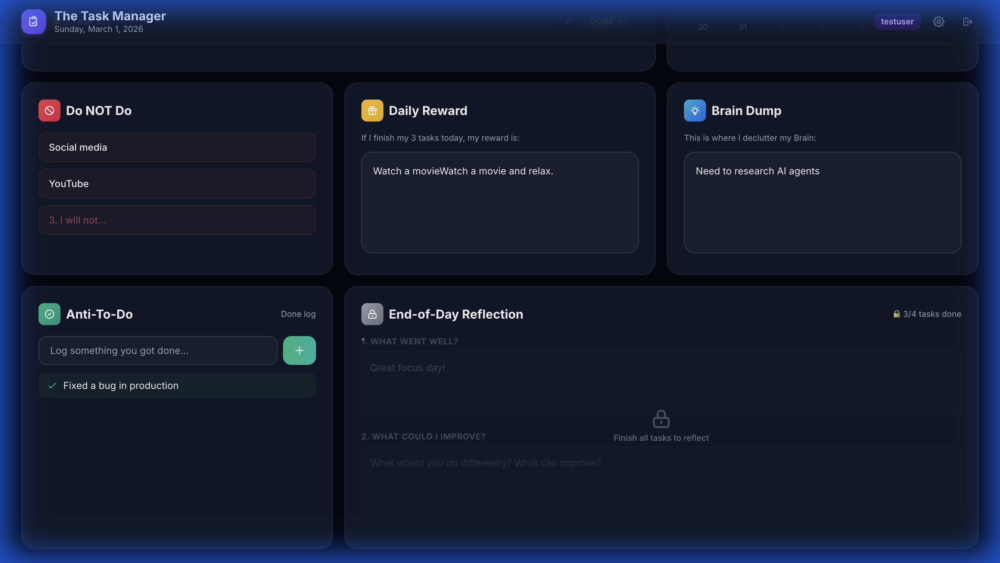
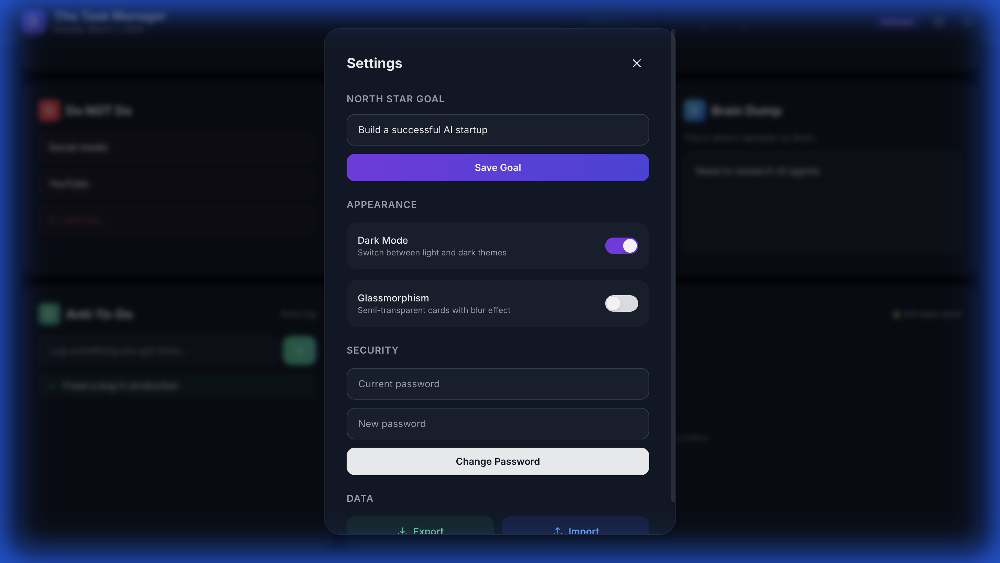

# ⚡ The Task Manager

A sleek, opinionated daily productivity dashboard built with **Node.js** and a gorgeous **dark glassmorphism** UI. Designed around the philosophy of doing *fewer things, better* — with a strict **5‑task daily limit**, carry‑over tracking, and built‑in reflection.


---

## ✨ Features

### 🎯 Daily 3 — Task Management
- **Strict 5‑task cap** — start with 3 slots, expand to 5 max. No more.
- **Custom color‑coded status dropdowns** — Todo (gray), In Progress (amber), Done (emerald), Cancelled (red)
- **Expandable task descriptions** — click the description icon to reveal a notes area
- **Auto‑saving** — every keystroke is debounced and persisted automatically



### 🔄 Carry‑Over System
- Detects unfinished tasks from yesterday and shows a **carry‑over banner**
- Displays real‑time **capacity info**: *"2 task(s) from yesterday • Capacity: 1 slot(s) free"*
- **Hard block** if tasks exceed capacity — red toast alert, no tasks moved
- **Smart insertion** — fills empty slots first, then appends up to the limit
- **↻N carry badge** — visual indicator showing how many times a task was carried forward

### 📅 Calendar
- **Mini calendar** with month/year navigation
- Click any date to view/edit that day's tasks
- **Green highlight** on days where all tasks were completed ✅
- **Violet dot** on days that have tasks but aren't fully done

### 🧰 Productivity Modules



| Module | Description |
|--------|-------------|
| 🚫 **Do NOT Do** | List up to 3 things to *avoid* today |
| 🎁 **Daily Reward** | What you'll treat yourself to after finishing |
| 🧠 **Brain Dump** | Free‑form textarea to clear your head |
| ✅ **Anti‑To‑Do** | Log things you *already did* (wins you didn't plan) |
| 🔒 **End‑of‑Day Reflection** | Two prompts — unlocks only when all tasks are Done |

### ⚙️ Settings



- **North Star Goal** — a persistent motivational headline
- **Dark Mode / Light Mode** toggle
- **Glassmorphism** toggle (frosted‑glass card effect)
- **Password change**
- **Export / Import** data as JSON
- **Danger Zone** — full data reset

---

## 🏗️ Project Structure

```
The Task Manager/
├── server.js             # Express backend — API, auth, data persistence
├── data.json             # JSON flat‑file database (auto-created)
├── package.json          # Dependencies & scripts
├── .env                  # Environment variables (see below)
├── .gitignore            # Ignores node_modules/ and .env
├── Dockerfile            # Multi-stage Docker build
├── docker-compose.yml    # One-command deployment
├── .dockerignore         # Keeps Docker image lean
├── docs/                 # Screenshots for README
│   ├── dashboard.png
│   ├── dropdown.png
│   ├── modules.png
│   └── settings.png
└── public/               # Frontend (served statically by Express)
    ├── index.html        # Main HTML — login/register + dashboard
    ├── style.css         # All styles (dark, light, glass themes)
    └── app.js            # Frontend logic — tasks, calendar, modules
```

---

## 🚀 Getting Started

### Prerequisites

- **Node.js** ≥ 18.x
- **npm** ≥ 9.x

### 1. Clone the repository

```bash
git clone https://github.com/yourusername/the-task-manager.git
cd the-task-manager
```

### 2. Install dependencies

```bash
npm install
```

This installs:
| Package | Purpose |
|---------|---------|
| `express` | Web server & API routing |
| `bcrypt` | Password hashing |
| `jsonwebtoken` | JWT‑based authentication |
| `cors` | Cross‑origin request handling |
| `dotenv` | Environment variable loading |

### 3. Configure environment variables

Create a `.env` file in the project root:

```env
# Secret key for signing JWT tokens — use a long random string
# A default is built in, but you should change this for production
JWT_SECRET=your-secret-key-here-change-this-in-production

# Port the server listens on
PORT=3000

# Directory where data.json is stored (default: project root)
# The Docker image uses /data — see Docker section below
# DATA_DIR=/path/to/data
```

> [!IMPORTANT]
> **Generate a strong JWT secret for production.** You can use:
> ```bash
> node -e "console.log(require('crypto').randomBytes(32).toString('hex'))"
> ```

### 4. Start the server

```bash
# Production
npm start

# Development (same command, but you can restart manually)
npm run dev
```

The app will be available at **http://localhost:3000**.

### 5. Create your account

Open the app in your browser. You'll see a login screen — click **Register** to create a new account with a username and password. Each user gets their own isolated data.

---

## 🐳 Docker Deployment

The fastest way to deploy — works out of the box with zero configuration.

### Quick Start (Docker Compose)

Create a `docker-compose.yml` file anywhere on your machine:

```yaml
services:
  task-manager:
    image: kshitijpatil508/task-manager:latest
    container_name: task-manager
    restart: unless-stopped
    ports:
      - "3000:3000"
    environment:
      - JWT_SECRET=tm_default_jwt_s3cret_k3y_2026
    volumes:
      - task-data:/data

volumes:
  task-data:
    driver: local
```

Then run:

```bash
docker compose up -d
```

That's it! The app is live at **http://localhost:3000** with:
- A **default JWT secret** baked in (works immediately, change for production)
- A **named Docker volume** (`task-data`) for persistent storage
- **Auto-restart** on crash or reboot

### Custom Configuration

Override any setting via environment variables in `docker-compose.yml`:

```yaml
services:
  task-manager:
    image: kshitijpatil508/task-manager:latest
    ports:
      - "3000:3000"
    environment:
      - JWT_SECRET=my-super-secret-production-key
      - PORT=3000
    volumes:
      - task-data:/data
```

Or pass environment variables directly:

```bash
JWT_SECRET=my-secret docker compose up -d
```

### Standalone Docker (without Compose)

```bash
# Pull the image
docker pull kshitijpatil508/task-manager:latest

# Run with a named volume for data persistence
docker run -d \
  --name task-manager \
  --restart unless-stopped \
  -p 3000:3000 \
  -v task-data:/data \
  kshitijpatil508/task-manager:latest
```

### Docker Image Details

| Property | Value |
|----------|-------|
| Base image | `node:20-alpine` |
| Image size | ~120 MB |
| Runs as | Non-root `node` user |
| Health check | `wget http://localhost:3000/` every 30s |
| Data volume | `/data` (stores `data.json`) |
| Build | Multi-stage (deps cached separately) |

### Docker + Caddy

To expose with HTTPS via Caddy, add Caddy to your `docker-compose.yml`:

```yaml
services:
  task-manager:
    image: kshitijpatil508/task-manager:latest
    restart: unless-stopped
    volumes:
      - task-data:/data

  caddy:
    image: caddy:2-alpine
    restart: unless-stopped
    ports:
      - "80:80"
      - "443:443"
    volumes:
      - ./Caddyfile:/etc/caddy/Caddyfile
      - caddy-data:/data
      - caddy-config:/config

volumes:
  task-data:
  caddy-data:
  caddy-config:
```

With a `Caddyfile`:

```caddyfile
tasks.yourdomain.com {
    reverse_proxy task-manager:3000
}
```

Then:
```bash
docker compose up -d
```

---

## 🌐 Deploying with Caddy (Reverse Proxy + HTTPS)

[Caddy](https://caddyserver.com/) is the easiest way to expose the app to the internet with **automatic HTTPS**.

### Prerequisites

- A **domain name** pointing to your server (e.g., `tasks.yourdomain.com`)
- **Caddy** installed on your server — [install guide](https://caddyserver.com/docs/install)

### Step 1: Install Caddy

**macOS (Homebrew):**
```bash
brew install caddy
```

**Ubuntu/Debian:**
```bash
sudo apt install -y debian-keyring debian-archive-keyring apt-transport-https curl
curl -1sLf 'https://dl.cloudsmith.io/public/caddy/stable/gpg.key' | sudo gpg --dearmor -o /usr/share/keyrings/caddy-stable-archive-keyring.gpg
curl -1sLf 'https://dl.cloudsmith.io/public/caddy/stable/debian.deb.txt' | sudo tee /etc/apt/sources.list.d/caddy-stable.list
sudo apt update
sudo apt install caddy
```

### Step 2: Create a Caddyfile

Create a file called `Caddyfile` in your project root (or `/etc/caddy/Caddyfile`):

```caddyfile
tasks.yourdomain.com {
    reverse_proxy localhost:3000
}
```

That's it — Caddy handles **SSL certificate provisioning** (via Let's Encrypt), **HTTPS redirect**, and **HTTP/2** automatically.

### Step 3: Start the Node.js app

Make sure your app is running in the background. Use **systemd** or **pm2**:

**Option A — Using pm2 (recommended):**
```bash
# Install pm2 globally
npm install -g pm2

# Start the app
pm2 start server.js --name task-manager

# Ensure it restarts on reboot
pm2 startup
pm2 save
```

**Option B — Using systemd:**

Create `/etc/systemd/system/task-manager.service`:

```ini
[Unit]
Description=The Task Manager
After=network.target

[Service]
Type=simple
User=your-username
WorkingDirectory=/path/to/the-task-manager
ExecStart=/usr/bin/node server.js
Restart=always
RestartSec=10
EnvironmentFile=/path/to/the-task-manager/.env

[Install]
WantedBy=multi-user.target
```

Then:
```bash
sudo systemctl daemon-reload
sudo systemctl enable task-manager
sudo systemctl start task-manager
```

### Step 4: Start Caddy

```bash
# If using the Caddyfile in the project root:
caddy start

# Or run Caddy as a system service:
sudo systemctl enable caddy
sudo systemctl start caddy
```

### Step 5: Verify

Open **https://tasks.yourdomain.com** in your browser. You should see the login screen with a valid HTTPS certificate. 🎉

### Local‑only access (no domain)

If you just want HTTPS on localhost or a LAN IP without a domain:

```caddyfile
:443 {
    tls internal
    reverse_proxy localhost:3000
}
```

This uses Caddy's built‑in CA to generate a self‑signed certificate. Run `caddy trust` to install the root certificate on your machine so browsers trust it.

---

## 🔒 Authentication

- Users register with a **username + password** (hashed with bcrypt)
- Login returns a **JWT token** stored in `localStorage`
- All API routes (except `/api/register` and `/api/login`) require the `Authorization: Bearer <token>` header
- Token‑based sessions — no cookies, no server‑side session store
- Change your password anytime via **Settings → Security**

---

## 📊 Data Storage

All data is stored in a single `data.json` file in the project root. This file is auto‑created on first run.

**Structure:**
```json
{
  "users": {
    "username": {
      "password": "$2b$10$...",
      "tasks": {
        "2026-03-01": [
          { "text": "Ship feature", "description": "", "status": "Done", "carryForwardCount": 0 }
        ]
      },
      "dailyData": {
        "2026-03-01": {
          "doNotDo": ["Social media", "", ""],
          "dailyReward": "Coffee break",
          "brainDump": "Need to research...",
          "antiToDo": ["Fixed a bug"],
          "reflectionGood": "Great focus day!",
          "reflectionImprove": "Start earlier"
        }
      },
      "settings": {
        "theme": "dark",
        "glass": false,
        "northStar": "Build a successful AI startup"
      }
    }
  }
}
```

> [!WARNING]
> **Back up `data.json` regularly.** It's a flat file — there's no database replication. Use the built‑in **Export** feature in Settings for easy backups.

---

## 🛠️ API Reference

| Method | Endpoint | Auth | Description |
|--------|----------|------|-------------|
| POST | `/api/register` | ✗ | Create a new user |
| POST | `/api/login` | ✗ | Login, returns JWT |
| GET | `/api/tasks/:date` | ✓ | Get tasks for a date |
| POST | `/api/tasks/:date` | ✓ | Save tasks (max 5 enforced) |
| GET | `/api/daily-data/:date` | ✓ | Get daily module data |
| POST | `/api/daily-data/:date` | ✓ | Save daily module data |
| GET | `/api/carry-over-check/:date` | ✓ | Check for unfinished tasks + capacity |
| POST | `/api/carry-over` | ✓ | Carry over tasks (409 if over capacity) |
| GET | `/api/task-dates` | ✓ | Get all dates with task data |
| GET | `/api/settings` | ✓ | Get user settings |
| POST | `/api/settings` | ✓ | Save user settings |
| POST | `/api/change-password` | ✓ | Change password |
| GET | `/api/export` | ✓ | Export all user data as JSON |
| POST | `/api/import` | ✓ | Import user data from JSON |
| POST | `/api/reset` | ✓ | Delete all user data |

---

## 📝 License

ISC
